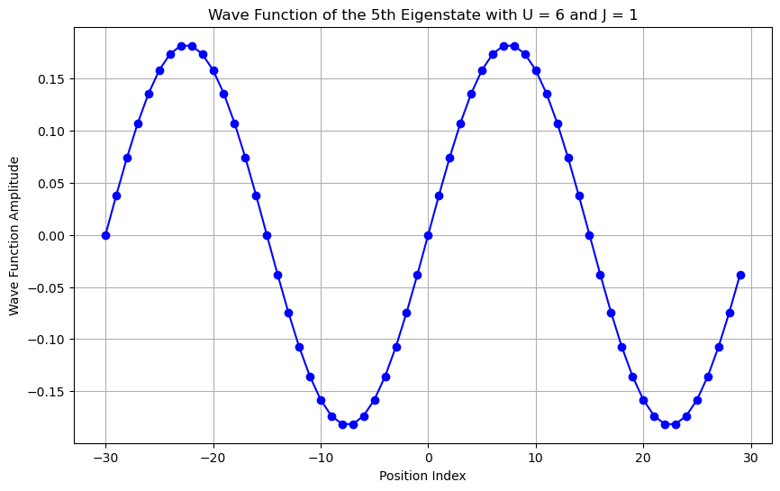
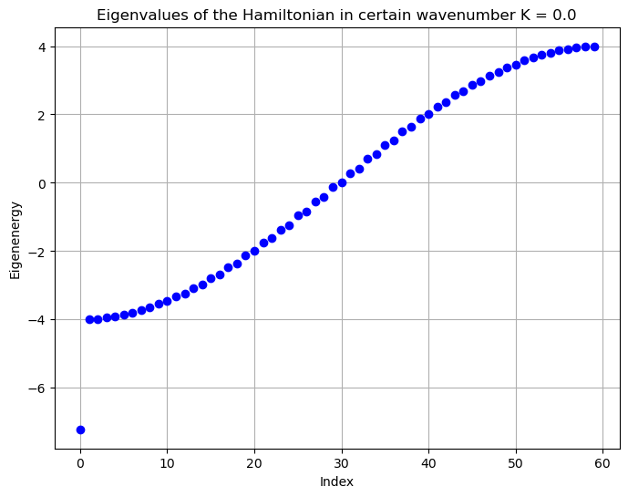
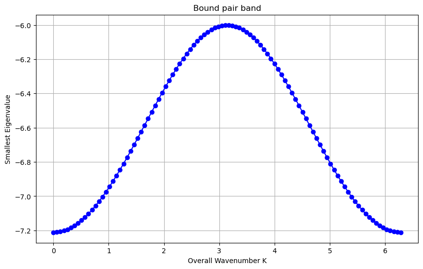
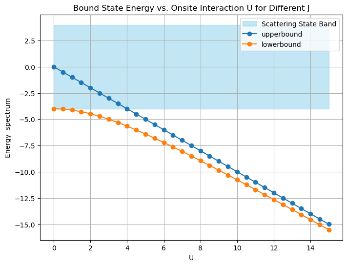
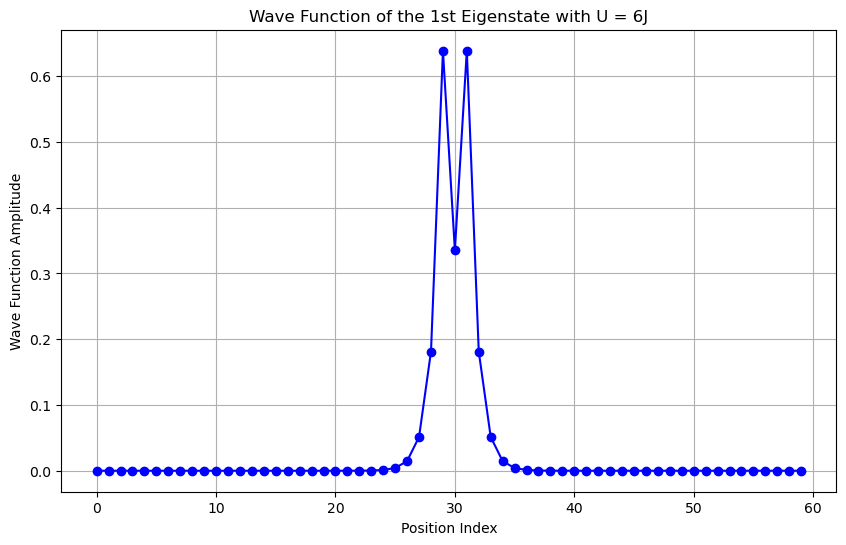
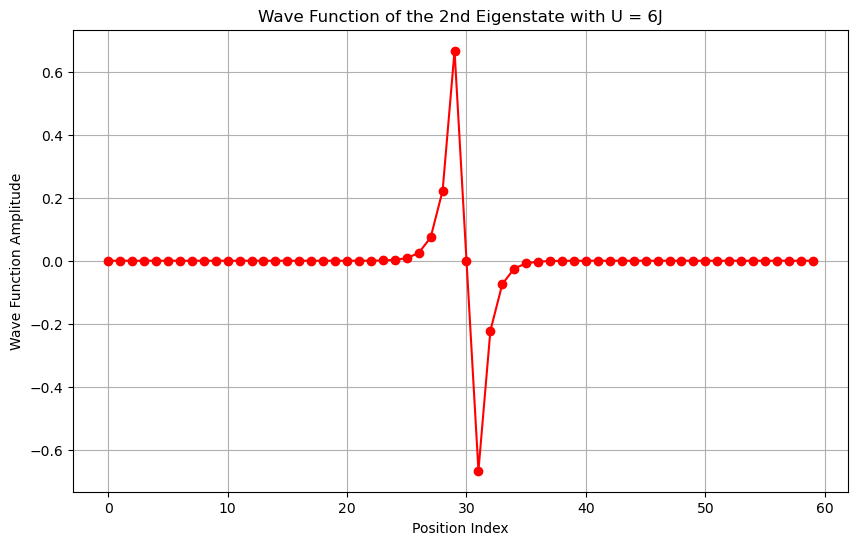
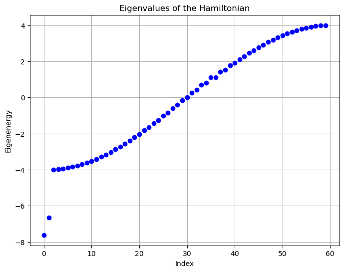

# Calculation for two photon bound state and its band

In this script, we solve for the eigenstates of a nonlinear waveguide in two-photon subspace. Because the system has discrete translational symmetry, we can use Bloch's theorem to write the stationary Schrödinger equation in a form about the relative displacement of the two photons.

The reference is the paper 'Supercorrelated Radiance in Nonlinear Photonic Waveguides' and its Supplemental Material.

Here is a link to this paper [URL](https://journals.aps.org/prl/abstract/10.1103/PhysRevLett.124.213601).


## Plot the relative wave function and the relative band of two ph system 
From its Supplemental Material, the equation(3) gives the eigenvalue equation of a given total total wavenumber K.

$$
E \psi_K(r) = -2 J_K (\psi_K(r+1)+\psi_K(r-1)) - U \delta(r) \psi_K(r)
$$

where $J_K = J \cos(K/2)$.
Without loss of generality, we assume that the frequency of cavity is 0.


```python
import numpy as np
import matplotlib.pyplot as plt
# Parameter settings
N = 60  # Number of lattice points
J = 1   # Hopping interaction (coupling constant)
U = 6   # Onsite interaction
K = 0*np.pi #overall wavenumber
Jk = J*np.cos(K/2)# Hopping interaction in relative space r=|n1-n2|

# Create Hamiltonian matrix
H = np.zeros((N, N))

# Build matrix elements for hopping terms
for i in range(N):
    H[i, (i + 1) % N] = -2 * Jk  # Periodic boundary conditions
    H[i, (i - 1) % N] = -2 * Jk  # Periodic boundary conditions

# Add Onsite interaction 
H[N//2, N//2] += - U

# Solve for eigenvalues and eigenvectors
eigenvalues, eigenvectors = np.linalg.eigh(H)


# Grid positions 
positions = np.arange(-N//2, N//2)

# Define the index of the eigenstate of interest
j = 4  # Can be changed to select different eigenstates, j=0->ground state of the system, which is also the 2 ph bound state

# Select the eigenvector corresponding to the j-th eigenvalue
wavefunction = eigenvectors[:, j]

# Plotting the wave function shape
plt.figure(figsize=(10, 6))
plt.plot(positions, wavefunction, marker='o', linestyle='-', color='blue')
plt.title(f'Wave Function of the {j+1}th Eigenstate with U = {U} and J = {J}')
plt.xlabel('Position Index')
plt.ylabel('Wave Function Amplitude')
plt.grid(True)
plt.show()


# Plot the eigenvalues
plt.figure(figsize=(8, 6))
plt.plot(eigenvalues, marker='o', linestyle='', color='blue')
plt.title(f'Eigenvalues of the Hamiltonian in certain wavenumber K = {K}')
plt.xlabel("Index")
plt.ylabel("Eigenenergy")
plt.grid(True)
plt.show()

```


    

    


    

    


All the states satisfied $j \neq 0$ is extended in the relative space, which indicates that there are scattering state. But the $j = 0$ state has a exponential decay in relative space, which indicates that it is a two photon bound state. Besides, the bound state has a energy gap from the scatering band which can be seen in the figure 2.(You can change the value of index j in the script to observe the relative wavefunction of it.)

## Observe the bound state band vs total wavenumber K

For every single wavenumber K, there is a single two photon bound state, so changing the wavenumber K will form a band for the 2 phtoton bound pair.


```python
import numpy as np
import matplotlib.pyplot as plt

# Parameter settings
N = 60  # Number of lattice points
J = 1   # Hopping interaction (coupling constant)
U = 6   # Onsite interaction

# Range of K values from 0 to 2*pi
K_values = np.linspace(0, 2 * np.pi, 100)
smallest_eigenvalues = []

for K in K_values:
    # Hopping interaction in relative space 
    Jk = J * np.cos(K / 2)

    # Create Hamiltonian matrix
    H = np.zeros((N, N))

    # Build matrix elements for hopping terms
    for i in range(N):
        H[i, (i + 1) % N] = -2 * Jk  # Periodic boundary conditions
        H[i, (i - 1) % N] = -2 * Jk  # Periodic boundary conditions

    # Add Onsite interaction 
    H[N // 2, N // 2] += -U

    # Solve for eigenvalues and eigenvectors
    eigenvalues, eigenvectors = np.linalg.eigh(H)

    # Store the smallest eigenvalue (bound state)
    smallest_eigenvalues.append(min(eigenvalues))

# Plotting the smallest eigenvalues as a function of K
plt.figure(figsize=(10, 6))
plt.plot(K_values, smallest_eigenvalues, marker='o', linestyle='-', color='blue')
plt.title('Bound pair band')
plt.xlabel('Overall Wavenumber K')
plt.ylabel('Smallest Eigenvalue')
plt.grid(True)
plt.show()

```


    

    


The bound state energy is at its minimum when $K=0$ and at its maximum when $K=\pi$.

## Calculating the  scattering band and the bound band changing the onsite interaction U

In the reference paper, they give a figure {figure1(b)} to illustate the influence of onsite interaction U. The following script are calculating to verify that. From the conclusion above, the bound state energy is at its minimum when $K=0$ and at its maximum when $K=\pi$. Therefore, we can use $J_K =1$ and $J_K =0$ to represent the bound band boundary for 2 photon.


```python
import numpy as np
import matplotlib.pyplot as plt

# Parameter settings
N = 60  # Number of lattice points
U_values = np.arange(0, 15.5, 0.5)  # U from 0 to 15 in steps of 0.5
J_values = [1, 0]  # Different J values for comparison(J=0(1) is the upper(lower) bound of the bound state)

# Prepare to store results
results = {}

# Calculate ground state energies for each J
for J in J_values:
    ground_state_energies = []
    for U in U_values:
        # Create the Hamiltonian matrix
        H = np.zeros((N, N))

        # Build matrix elements for hopping terms
        for i in range(N):
            H[i, (i + 1) % N] = -2 * J  # Periodic boundary conditions
            H[i, (i - 1) % N] = -2 * J  # Periodic boundary conditions

        # Add onsite interaction term
        H[0, 0] += -U

        # Solve for eigenvalues
        eigenvalues, _ = np.linalg.eigh(H)
        ground_state_energies.append(np.min(eigenvalues))
    
    # Store results for current J
    results[J] = ground_state_energies

# Plotting ground state energy vs. U for both J=1 and J=0
plt.figure(figsize=(8, 6))
plt.fill_betweenx([-4, 4], 0, 15, color='skyblue', alpha=0.5, label='Scattering State Band')
plt.plot(U_values, results[0], marker='o', linestyle='-', label=f'upperbound')
plt.plot(U_values, results[1], marker='o', linestyle='-', label=f'lowerbound')
plt.title('Bound State Energy vs. Onsite Interaction U for Different J')
plt.xlabel('U')
plt.ylabel('Energy  spectrum')
plt.legend()
plt.grid(True)
plt.show()

```


    

    


##  Calculation of two photon property for a waveguide with ZZ interaction
If the system have a ZZ interaction with a next nearest neighbor site, it will form two bound state with different parity.


```python
# Two bound state of the system with ZZ interaction
import numpy as np
import matplotlib.pyplot as plt

# Parameter settings
N = 60  # Number of lattice points
J = 1   # Hopping interaction (coupling constant)
U = 6   # Onsite interaction
K = 0*np.pi #overall wavenumber
Jk = J*np.cos(K/2)# Hopping interaction in relative space r=|n1-n2|

# Create the Hamiltonian matrix
H = np.zeros((N, N))

# Construct matrix elements for the hopping terms
for i in range(N):
    H[i, (i + 1) % N] = -2 * Jk  # Periodic boundary conditions
    H[i, (i - 1) % N] = -2 * Jk  # Periodic boundary conditions

# Add ZZ interaction with a distance
H[29, 29] += - U
H[31, 31] += - U

# Solve for eigenvalues and eigenvectors
eigenvalues, eigenvectors = np.linalg.eigh(H)

# Grid positions
positions = np.arange(N)

# Select the eigenvector corresponding to the 0-th eigenvalue
wavefunction0 = eigenvectors[:, 0]

# Select the eigenvector corresponding to the 1-st eigenvalue
wavefunction1 = eigenvectors[:, 1]

# Plotting the wave function shape for the 0-th eigenstate
plt.figure(figsize=(10, 6))
plt.plot(positions, wavefunction0, marker='o', linestyle='-', color='blue')
plt.title('Wave Function of the 1st Eigenstate with U = 6J')
plt.xlabel('Position Index')
plt.ylabel('Wave Function Amplitude')
plt.grid(True)
plt.show()

# Plotting the wave function shape for the 1-st eigenstate
plt.figure(figsize=(10, 6))
plt.plot(positions, wavefunction1, marker='o', linestyle='-', color='red')
plt.title('Wave Function of the 2nd Eigenstate with U = 6J')
plt.xlabel('Position Index')
plt.ylabel('Wave Function Amplitude')
plt.grid(True)
plt.show()

# Plot the eigenvalues
plt.figure(figsize=(8, 6))
plt.plot(eigenvalues, marker='o', linestyle='', color='blue')
plt.title("Eigenvalues of the Hamiltonian")
plt.xlabel("Index")
plt.ylabel("Eigenenergy")
plt.grid(True)
plt.show()
```


    

    


    

    


    

    


```python

```
